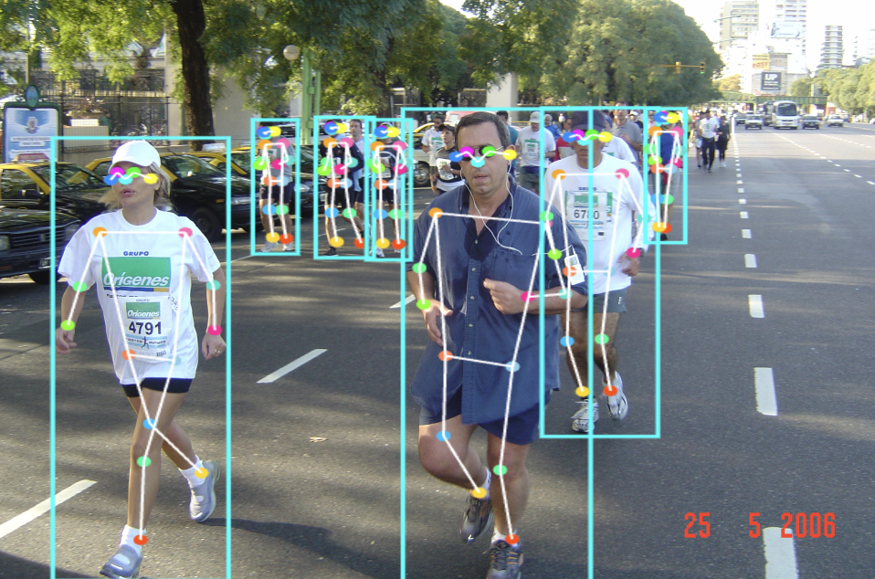

# YOLOv8 with TensorflowJS

<p align="center">
  
</p>

YOLOv8 running locally in your browser using TensorflowJS.

Try out the [Live Demo](https://yolov8.theos.ai/).

**Run**

```bash
npm install
npm start
```

**Use your own model**

Update `modelURL` in `App.jsx`
   ```jsx
   const modelURL = 'paste-here-your-manifes-url';
   ```